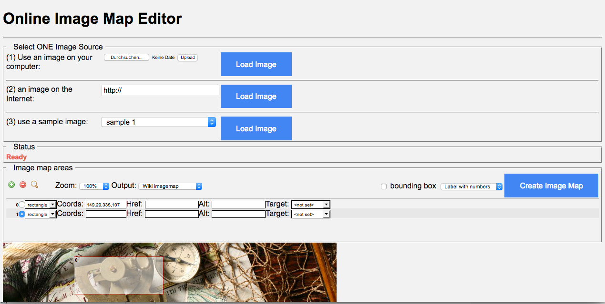

# imgmap: Javascript based ImageMap Editor

With the imagemap editor you can easily draw ALL the standard image map shapes (rectangle, circle, polygon),
and you can have full control over the generated HTML code as well.

* [Online Image Editor](https://niebert.github.io/imgmap/index.html)

The Online Image Editor runs in your browser and the images are not uploaded to any server. You can download the repository.

## Purpose of the Fork
change the User Interface provided by Adam Maschek:
* set the default imagemap main export format to the MediaWiki
* use the javascript code in an HTML file the docs/ folder in GitHub,
* rename buttons and change layout for the Source Selector,
* add a "Create Image Map" Button to the user interface.
* upload files with [FileReader API](https://developer.mozilla.org/de/docs/Web/API/FileReader) - see [Code-Pen Example]](https://codepen.io/matt-west/pen/KjEHg) 
* create a WebApp that works offline - no internet and server connectivity neccessary, if local images are used. Just [download ZIP](https://github.com/niebert/imgmap/archive/master.zip) and start ___index.html___ in ___/docs___ folder.

## Technical Description
The editor natively uses the canvas HTML element to draw the shapes on a given image.
The ExplorerCanvas (http://excanvas.sourceforge.net/) library from Google is used to get the same result in browsers, that do not support the
canvas element but can use VML instead. ExplorerCanvas works quite well, however it is still beta quality,
and not as fast as the native canvas drawing, so expect some lags in IE.
The editor is currently tested to work in Chrome, Firefox, Safari, Opera 9+ and IE 6+.

## Links
* [Online Image Editor](https://niebert.github.io/imgmap)
* [Wikiversity support for Image Maps in MediaWiki](https://en.wikiversity.org/wiki/GNU_Image_Manipulation_Program_(GIMP)/Image_maps)
* [Source code of Image Editor by Adam Maschek](https://github.com/maschek/imgmap)
* [Adapted Source code of Image Editor by Adam Maschek](https://github.com/niebert/imgmap) in docs folder
* [Download Link of Adapted ImageMap Editor](https://github.com/niebert/imgmap/archive/master.zip)
* [Loading Images into a HTML5 WebApp](https://www.html5rocks.com/en/tutorials/file/dndfiles/) needed for uploading local images provided by  Eric Bidelman

## Acknowledgement
Special thanks to [Adam Maschek](https://github.com/maschek) for sharing the code for Javascript ImageMap Editor on Github.
See the original online editor at: http://www.maschek.hu/imagemap/imgmap

The forked image map editor was tailored for [Wikiversity](https://en.wikiversity.org/wiki/Risk_Literacy/Real_World_Labs/web-based_exploration).

## Note:
The code repository was originally hosted at google code and migrated to github on March 30, 2015
